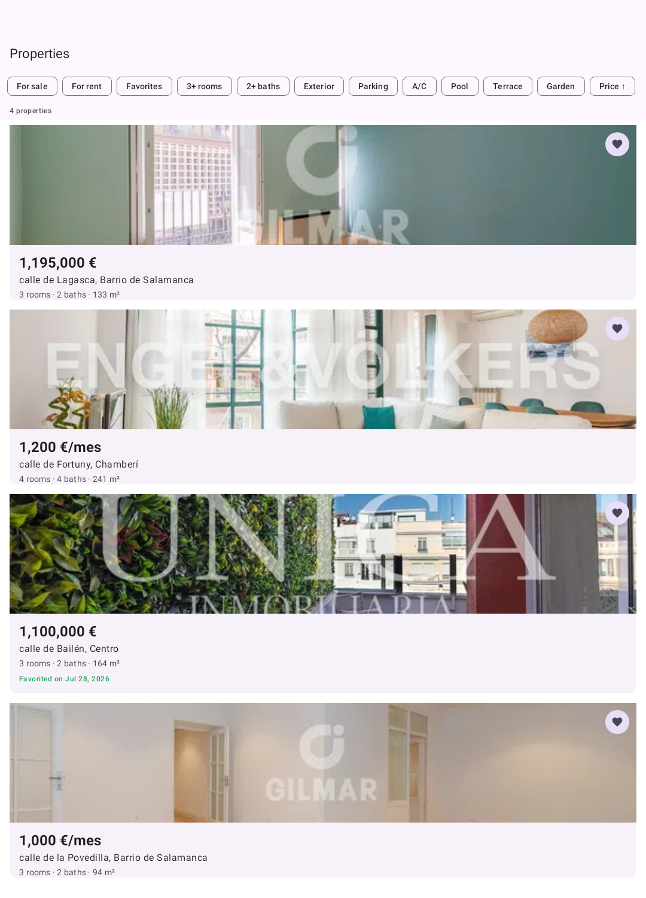
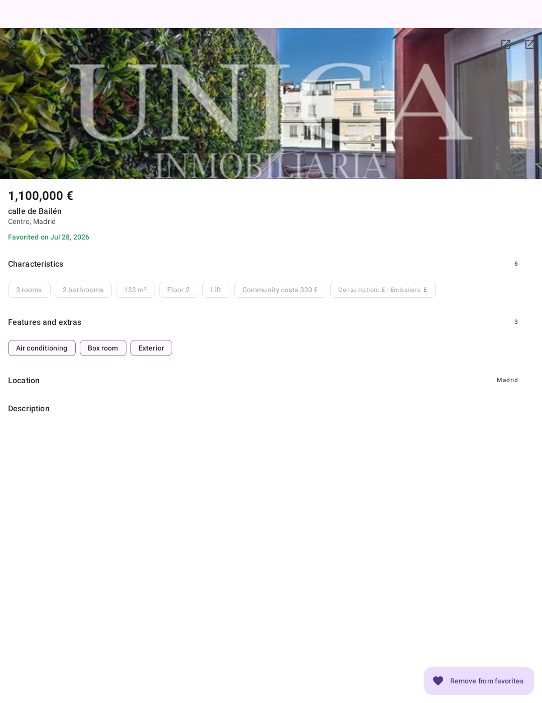
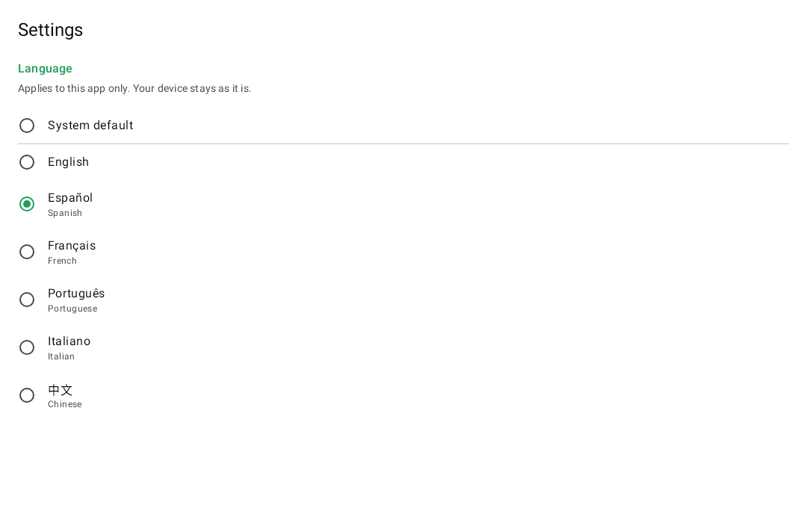
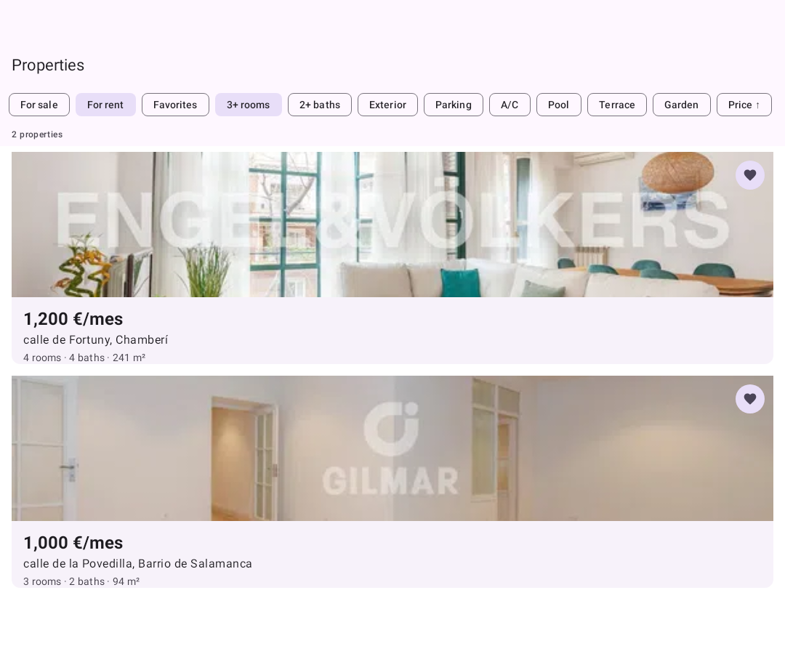
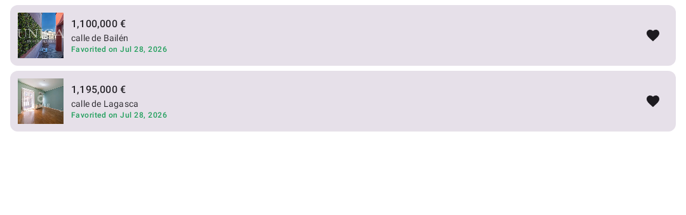

# idealista Android challenge — submission

An Android app for browsing property ads: browse a list, open an ad, save it as a favorite and see
the date you saved it. Kotlin, XML views, nine Gradle modules, six languages, a map, **122 tests**
and CI.

The original brief is preserved verbatim at the bottom of this file.

<p align="center">
  
  
  
</p>

---

## Run it

```bash
./gradlew runDebug              # build, install AND launch on a running emulator/device
./gradlew testDebugUnitTest     # 122 tests
./gradlew lint assembleDebug
./gradlew screenshots           # regenerate docs/screenshots without a device
```

`runDebug` exists because `installDebug` only installs — it does not start the app, and `adb` is
often not on `PATH`. The task finds `adb` via `local.properties` or `ANDROID_HOME` and launches the
activity, so nothing has to be done by hand.

Needs the Android SDK (`platforms;android-37.1`, `build-tools;37.0.0`) and a JDK 21 to run Gradle;
the build itself targets JDK 17 through a toolchain it provisions automatically. Every green CI run
also publishes a debug APK as an artifact, so the app can be sideloaded without a local toolchain.

---

## ✅ Minimum requirements

Everything the brief asked for, and where it lives.

| Requirement | Status | Where |
|---|---|---|
| At least **two screens** | ✅ | A list screen and a detail screen, plus favorites, map and settings |
| A **listing screen** showing a collection of ads | ✅ | `AdListFragment` — RecyclerView + `ListAdapter` + `DiffUtil`, Coil, swipe-to-refresh |
| A **detail screen** for viewing ad information | ✅ | `AdDetailFragment` — collapsing toolbar, `ViewPager2` gallery, collapsible sections |
| **Kotlin** | ✅ | Every module. No Java source in the repository |
| **XML views** | ✅ | Both mandatory screens are XML with ViewBinding — no `findViewById`, no synthetics |
| **Favorite ads** | ✅ | `favorites` table + `AdRepository.toggleFavorite`, from the list, the detail screen or the favorites screen |
| Show the **date** it was favorited | ✅ | On all three surfaces, from one source — `java.time`, localized via `DateTimeFormatter.ofLocalizedDate(MEDIUM)` |
| **Use AI tools** | ✅ | [`docs/AI_USAGE.md`](docs/AI_USAGE.md) — including what the AI got *wrong*, and how each was caught |

## 🎁 Bonus tasks

| Bonus | Status | What we did |
|---|---|---|
| **Tests of different types** | ✅ | 122 tests across eight tiers: contract, mapper, repository + Room, pure-domain, ViewModel, view, Compose UI, end-to-end. [`docs/TESTING.md`](docs/TESTING.md) |
| **Jetpack Compose alongside XML** | ✅ | Both placements: two Compose-only screens (favorites, settings) **and** a `ComposeView` embedded inside the XML detail screen |
| **Persistent storage** | ✅ | Room as the single source of truth — ad cache + favorites. Works offline, survives restarts |
| **Submit your AI context files** | ✅ | [`CLAUDE.md`](CLAUDE.md), committed deliberately |

## ✨ Beyond the brief

Nothing in this table was asked for. Each row says what it is and why it was worth building.

| Feature | What it does | Why |
|---|---|---|
| **Map screen** | A pannable, zoomable OpenStreetMap of every ad. Tap a pin → a card → the same detail screen. | Location is the first thing anyone asks about a property, and the payload has coordinates nobody was using. OSM tiles rather than Google Maps because a Maps key is a secret and a submission should carry none ([ADR-0010](docs/DECISIONS/ADR-0010-map.md)) |
| **Six languages** | English, Spanish, French, Portuguese, Italian, Chinese — picked in Settings | idealista is a multi-market business. The choice goes through the *platform's* per-app locale, so it also appears in Android's own language settings ([ADR-0009](docs/DECISIONS/ADR-0009-per-app-language.md)) |
| **Translated listings** | The Spanish description is translated on-device into the chosen language, and marked as translated | Localizing the buttons does not help someone who cannot read the listing. ML Kit on-device: no API key, works offline after the first model download ([ADR-0011](docs/DECISIONS/ADR-0011-content-translation.md)) |
| **Filters** | Operation, rooms, baths, exterior, parking, amenities, price — client-side over the cache | Browsing property *is* filtering. Only criteria the list payload can actually answer are offered ([ADR-0008](docs/DECISIONS/ADR-0008-filters-and-external-links.md)) |
| **External links** | Listing page and full-size photos in a Custom Tab; the address in a maps app | The payload carries real URLs and coordinates that went nowhere |
| **Collapsible detail sections** | Characteristics, features, location and description as expandable accordions | The detail screen was a wall of text. Sections survive rotation |
| **Edge-to-edge insets** | Every system bar consumed where it is owned | Content was drawing under the camera cutout |
| **Offline-first** | The network only writes to Room; the UI only reads from Room | A failed refresh must not hide ads you can still read |
| **`./gradlew runDebug`** | Builds, installs **and launches**, resolving `adb` itself | `installDebug` leaves you at a home screen wondering where the app went |
| **`./gradlew screenshots`** | Renders the real screens to PNGs with no device | Screenshots that regenerate from the real layouts cannot go stale |
| **CI** | lint + tests + APK on every push | Verification nobody has to remember to run |

---

## How the app works

Four tabs, one activity.

**Properties** is the list. It reads from Room, never from the network directly, so it renders
instantly on a cold start and keeps working offline. Pull down to refresh. The chip row filters the
cached ads client-side — no request, works offline — and a filter that excludes everything says
*"no properties match these filters"* rather than looking like a failed load. The heart on a card
saves the ad and stamps it with today's date.

**Detail** opens when you tap a card. It is the screen where this challenge's trap lives — see
below. The gallery is a `ViewPager2` of that ad's photos; tapping one opens it full-size in a Custom
Tab. Characteristics, features, location and description are accordions, each showing a summary
while collapsed. The toolbar menu opens the listing on idealista; a button opens the address in a
maps app. If the app is not in Spanish, the description is translated on-device and marked as such.

**Favorites** is Compose. Every saved ad with the date you saved it.

**Map** places every ad on OpenStreetMap tiles. Pan and zoom like any web map; tap a pin for a card
with the price and address, tap the card to open the same detail screen the list opens.

**Settings** picks the app's language, independently of the device.

The favorited date is identical everywhere because there is exactly one source of it: `observeAds()`
is a single `combine` of the ads table and the favorites table. No screen knows how favorites are
stored, and no two screens can disagree.

### Screens

| | |
|---|---|
|  |  |
| **Properties** — the real payload, four Madrid flats, the filter row, and the favorited date on the third card | **Filtered** — *For rent* + *3+ rooms* applied; the result count follows the chips |
|  |  |
| **Detail** — ad 3's own photo and price, the characteristics panel (Compose inside XML), and collapsible sections | **Favorites** — Compose, with the date each ad was saved |
|  | |
| **Settings** — each language named in its own language, plus "System default" | |

These are **not** device screenshots. There is no emulator in the development container, so
`./gradlew screenshots` rasterises the real layouts, the real adapters and the real photos offscreen
through Robolectric's native-graphics backend. The map screen is absent from this set on purpose:
osmdroid fetches its tiles at runtime, so offscreen it renders an empty grid, and a picture of an
empty grid is worse than no picture.

---

## The one thing worth reading first

`detail.json` **always returns the same payload** (ad 1) no matter which ad you open — the brief says
so in passing, and it is the trap in this challenge. It also uses a different id type (`Int adid` vs
`String propertyCode`) and a different price shape than the list endpoint.

Binding that response straight to the UI produces an app that looks perfect on ad 1 and silently
shows the wrong price, address, location **and photos** for ads 2–4. This app instead **merges**:

| From the **cached list ad** | From the **detail response** |
|---|---|
| id, address, district, price, operation | characteristics (rooms, floor, lift, community costs) |
| thumbnail **and the photo gallery** | the energy certificate |
| favorite state and date | the long `propertyComment` |

The detail DTO's `adid`, `priceInfo`, `ubication` and `multimedia` are discarded on purpose.

**Photos are identity, not content.** That half of it was a real shipped bug — caught by a person
looking at the running app, not by the test suite — putting ad 1's rooms under ads 2, 3 and 4. The
fix, and the alignment tests that now prevent it, are recorded in
[`docs/DELIVERY_LOG.md`](docs/DELIVERY_LOG.md) rather than quietly patched.

See [`docs/DECISIONS/ADR-0005-detail-merge-strategy.md`](docs/DECISIONS/ADR-0005-detail-merge-strategy.md).

---

## Architecture

### Module graph

```
                    ┌────────────────────────────────────────────┐
                    │                   :app                     │
                    │  Application · MainActivity · bottom nav    │
                    │  screen wiring · Hilt entry point          │
                    └─┬───────┬────────┬────────┬────────┬───────┘
                      │       │        │        │        │
            ┌─────────▼┐ ┌────▼───┐ ┌──▼─────┐ ┌▼───────┐ ┌▼─────────┐
            │ :feature │ │:feature│ │:feature│ │:feature│ │ :feature │
            │  :list   │ │:detail │ │  :map  │ │:favor… │ │ :settings│
            │  (XML)   │ │ (XML + │ │ (XML + │ │(Compose│ │ (Compose)│
            │          │ │Compose)│ │  OSM)  │ │  only) │ │          │
            └─────────┬┘ └────┬───┘ └──┬─────┘ └┬───────┘ └┬─────────┘
                      │       │        │        │          │
                    ┌─▼───────▼────────▼────────▼──────────▼──┐
                    │              :core:data                 │
                    │  Retrofit · kotlinx.serialization · Room │
                    │  DTOs · mappers · AdRepository · translate│
                    └───────────────────┬─────────────────────┘
                                        │
                    ┌───────────────────▼─────────────────────┐
                    │             :core:model                 │
                    │  Ad · AdDetail · AdFilters · AppLanguage │
                    │  MapBounds · AdLinks  — no Android deps  │
                    └─────────────────────────────────────────┘

     :core:designsystem   Material 3 + Compose theme · AccordionSection ·
                          ExternalLinks · AppLocales · Formatters
     :core:testing        shared fixtures · the screenshot renderer
     build-logic          convention plugins, so module scripts stay ~10 lines
```

**The rules.** `:feature:*` → `:core:data` → `:core:model`. Features never depend on each other: the
list exposes an `onAdSelected` callback and `MainActivity` decides what to open, so the map and the
list can both open the detail screen without either knowing the other exists. DTOs never leave
`:core:data` — they are mapped to `:core:model` types at the data-source boundary. `:core:model` has
no Android imports at all, which is why filter logic, tag parsing and map bounds are tested on the
plain JVM with no emulator and no Robolectric.

### Data flow

```
   idealista.github.io                 Room                          UI
   ───────────────────                 ────                          ──
   list.json  ──→ DTO ──→ mapper ──→ ads table ───┬── observeAds() ──→ List
                                          ⨝       ├── observeAds() ──→ Map
                                     favorites    │
                                       table  ────┴── observeAds() ──→ Favorites

   detail.json ─→ DTO ─→ merge(cached ad, response) ─→ observeAdDetail() ─→ Detail
                                 ▲
                        identity from the cache,
                        rich content from the response
```

Room is the single source of truth: the network only ever *writes* into the cache, and the UI only
ever *reads* from it. That is what makes a failed refresh harmless, the app usable on a plane, and
the favorited date consistent across three screens for free.

### Patterns

- **MVVM with unidirectional state.** One `StateFlow<UiState>` per screen, sealed states
  (`Loading` / `Content` / `Empty` / `NoMatches` / `Error`), collected under `repeatOnLifecycle`.
  No `LiveData`.
- **Hilt** for DI throughout. Dispatchers and the `Clock` are injected, so favorite timestamps are
  asserted exactly rather than approximately.
- **ViewBinding** in every fragment.
- **`SavedStateHandle`** carries the selected `propertyCode`, so a backgrounded detail screen
  reopens on the right ad after process death.
- **Coroutines only.** No RxJava, no callbacks above the data layer.
- Every user-facing string is a resource, in six locales. Lint fails the build if one is missing —
  verified by deleting one and watching it go red.

Full detail, with diagrams: [`docs/ARCHITECTURE.md`](docs/ARCHITECTURE.md).

---

## Testing

**122 tests, all passing**, across eight tiers:

| Tier | Tool | Runs headless? |
|---|---|---|
| API contract | MockWebServer against the committed payloads | ✅ |
| Mappers | JUnit | ✅ |
| Repository + Room | in-memory Room, Robolectric, Turbine | ✅ |
| Pure domain — filters, links, languages, map bounds | plain JUnit, no Android runtime | ✅ |
| ViewModels | coroutines-test + Turbine | ✅ |
| Views — chips, accordion, external links, image alignment | Robolectric | ✅ |
| Compose UI | `createComposeRule` under Robolectric | ✅ |
| End-to-end | Espresso + Hilt test runner | ❌ authored, needs a device |

Three properties are load-bearing and pinned at more than one level: the favorited date is the same
on every screen; opening ad 3 never renders ad 1's identity; and every photo belongs to the ad it
appears under. [`docs/TESTING.md`](docs/TESTING.md) says which tiers ran and which did not — and
lists the bugs a failing test actually caught, including a retry button that was permanently dead
after any network error while looking entirely normal.

---

## Honest caveats

Things a reviewer would otherwise have to discover.

- **The Espresso end-to-end test has never been executed.** It is authored and compiles on every
  build, but running it needs a device and neither the development container nor CI has one. Marked
  as such everywhere rather than deleted or counted as passing.
- **On-device translation has never been executed either.** ML Kit needs a real device to download
  its models. The orchestration around it is tested against a fake — the screen renders while a
  translation is pending, a failure falls back to the Spanish original — but the translator itself is
  code that has been written and not run.
- **Applying a locale is not unit-testable.** Robolectric's sandbox has no per-app locale store, so
  `setApplicationLocales` is a no-op there. Tests written for it were **deleted rather than made to
  pass against a stub**.
- **The window-insets fix has no automated test.** Insets need a real window.
- **The listing links are well-formed but will not resolve.** The mock property codes are `1`–`4`
  where real idealista codes are eight digits. The URL shape is production-correct and the data is
  not; the photo and map links do work.
- **Map tiles come from the OSM foundation's public servers.** Fine for a submission, and the user
  agent is set as their usage policy requires — a production app would use a paid tile host, or
  Google Maps with a properly managed key.
- **Coil is pinned to 3.4.0** and **Robolectric to `sdk=36`** — the project sits ahead of what those
  libraries have shipped for AGP 9 / API 37. Recorded in ADR-0001.

---

## Documentation

| Document | What it answers |
|---|---|
| [`docs/DELIVERY_LOG.md`](docs/DELIVERY_LOG.md) | What was built, in what order, and the **actual** command output proving it — including the builds that went red |
| [`docs/AI_USAGE.md`](docs/AI_USAGE.md) | Which AI tools, what they got wrong, how each was caught |
| [`docs/ARCHITECTURE.md`](docs/ARCHITECTURE.md) | Module and data-flow diagrams, layer rules |
| [`docs/API.md`](docs/API.md) | Both endpoints, every field, and the three quirks |
| [`docs/TESTING.md`](docs/TESTING.md) | Test tiers, and which cannot run headless |
| [`docs/DECISIONS/`](docs/DECISIONS/) | 11 ADRs |
| [`CLAUDE.md`](CLAUDE.md) | Project context for AI tools |

The rule for `DELIVERY_LOG.md`: nothing is recorded as done unless a command was run and its real
output backs it up. That is why it also records the four toolchain pins that turned out to be wrong,
and the day the app shipped the wrong photos.

---

## Toolchain

AGP 9.3.1 · Gradle 9.6.1 · Kotlin 2.2.10 (AGP's built-in) · KSP 2.2.10-2.0.2 · Hilt 2.60.1 ·
Room 2.8.4 · Compose BOM 2026.06.01 · Retrofit 3.0.0 · OkHttp 5.4.0 · Coil 3.4.0 · osmdroid 6.1.20 ·
ML Kit Translate 17.0.3 · compileSdk 37 · targetSdk 37 · minSdk 24 with core library desugaring

Every version lives in `gradle/libs.versions.toml`; SDK levels live in `build-logic`. No module
script hardcodes a version. The toolchain was chosen by querying Maven metadata and then **validated
empirically** — four of the planned pins were wrong, and the build said so
([ADR-0001](docs/DECISIONS/ADR-0001-toolchain.md)).

---

# The original brief

idealista Android crew needs you! We need a fellow to face our everyday challenges: new features, problem fixes, UI design, performance, security, backwards compatibility, testing...

We need your help to build the next amazing features that will bring our user experiences to the next level, are you ready to go?

We love clean code and beautiful layouts, structured implementation and testable components. Does it sound good to you? This is your challenge!
&nbsp;

### 🚀 Getting started
- Read the minimum requirements.
- Start a new project from scratch.
- Think, design, code and have fun!
&nbsp;

### 📱 Task
Build an app that allows users to browse through a list of ads and view ad details on a separate screen.
&nbsp;

### 🌐 API endpoints
- List: [https://idealista.github.io/android-challenge/list.json](https://idealista.github.io/android-challenge/list.json)  
- Detail: [https://idealista.github.io/android-challenge/detail.json](https://idealista.github.io/android-challenge/detail.json) *Please note: the response is always the same*.
&nbsp;

### ✅ Minimum Requirements
- The app should include at least **two screens**:
  - A **listing screen** displaying a collection of ads.
  - A **detail screen** for viewing ad information.
- The code must be written in **Kotlin** and use **xml views**.
- Implement feature to allow users to **favorite ads**.
  - If an ad is favorited, display the **date** it was favorited.
- **Use AI tools** (e.g. GitHub Copilot, ChatGPT, Claude, Cursor, etc.) during the development of the challenge. We want to see how you leverage these tools in your workflow.
&nbsp;

### 🎁 Some optional tasks to do (bonus):
- Tests of different types could be great idea.
- Some **Jetpack Compose** code alongside xml.
- Implement **persistent storage**.
- Feel free to go beyond the requirements and **improve the app** in any way you think is best — we love creativity!
- If you used any **AI context files** to help the AI tool understand your project (e.g. `CLAUDE.md`, `.cursorrules`, `.github/copilot-instructions.md`, system prompts, or similar harness/context engineering files), include them in your submission.
&nbsp;

### 🥳 Once you've finished
- Email us at [android@idealista.com](mailto:android@idealista.com) with your repository link you'd like our Android team to review, or send the project folder (including the `.git` directory).
- Celebrate after a well done job! 🥳
