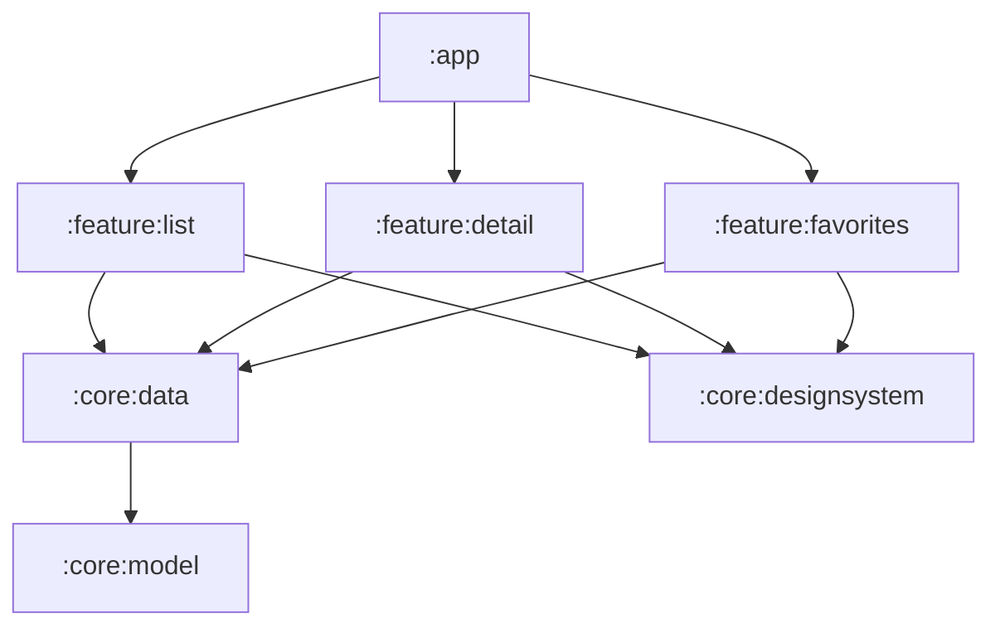
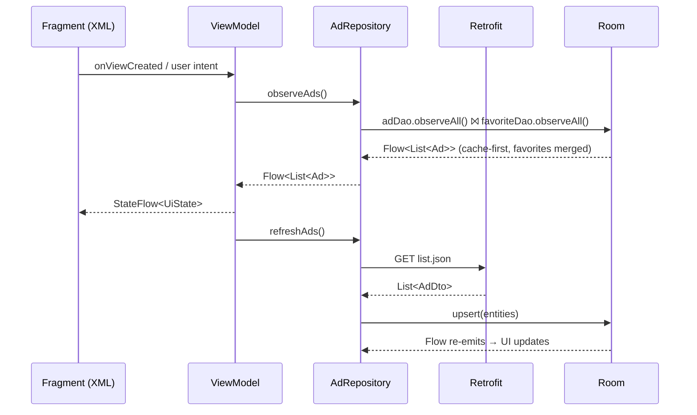

# Architecture

> Status: **planned**. No application code exists yet — see `DELIVERY_LOG.md`.

MVVM with unidirectional state, Clean-ish layering, and a Gradle module per concern.

## Modules



| Module | Contains | Why separate |
|---|---|---|
| `:app` | `Application`, Hilt setup, `MainActivity`, nav graph, bottom navigation | Thin shell; owns wiring only |
| `:core:model` | `Ad`, `AdDetail`, `Favorite` — pure Kotlin | No Android deps ⇒ fastest possible JVM tests |
| `:core:data` | Retrofit + kotlinx.serialization, Room, DTOs, mappers, repository | One owner for both API quirks |
| `:core:designsystem` | Material 3 theme, styles, drawables, Compose theme | Keeps XML and Compose visually identical |
| `:core:testing` | `MainDispatcherRule`, fakes, JSON fixtures | Stops test helpers leaking into production sources |
| `:feature:list` | XML list screen | Mandatory requirement 1 |
| `:feature:detail` | XML detail screen + one embedded `ComposeView` | Mandatory requirement 2 + interop bonus |
| `:feature:favorites` | Compose-only screen | Compose bonus without touching the mandatory XML screens |

**Dependency rules:** `:feature:*` → `:core:data` → `:core:model`; features never depend on each
other; DTOs never leave `:core:data`.

`build-logic` (an included build) supplies convention plugins — `android.application`,
`android.library`, `android.feature`, `android.hilt`, `jvm.library` — so a module script stays around
ten lines. `gradle/libs.versions.toml` is the single source of versions.

## Data flow



Room is the single source of truth: the network only ever writes into the cache, and the UI only
ever reads from the cache. That gives offline support and instant favorite feedback for free.

## Repository

```kotlin
interface AdRepository {
    fun observeAds(): Flow<List<Ad>>               // cache ⨝ favorites
    suspend fun refreshAds(): Result<Unit>
    fun observeAdDetail(code: String): Flow<AdDetail>
    suspend fun toggleFavorite(code: String)
}
```

- `observeAds()` is `combine(adDao.observeAll(), favoriteDao.observeAll())`, so favorite state and
  its date reach the list, the detail screen and the favorites screen from **one** place.
- `observeAdDetail(code)` merges the cached list ad (identity) with the detail response (rich
  fields) — see [`API.md`](API.md) and
  [`DECISIONS/ADR-0005-detail-merge-strategy.md`](DECISIONS/ADR-0005-detail-merge-strategy.md).
- `toggleFavorite(code)` inserts `Favorite(code, Instant.now())` or deletes the row.

## Persistence

```sql
ads(property_code TEXT PRIMARY KEY, … , images TEXT)      -- offline cache
favorites(property_code TEXT PRIMARY KEY, favorited_at INTEGER NOT NULL)
```

`favorited_at` is epoch millis, rendered with `java.time` +
`DateTimeFormatter.ofLocalizedDate(MEDIUM)` in the system zone via a localized string resource.
`minSdk 24` keeps `java.time` available through core library desugaring.

## Presentation

One `MainActivity` + Navigation Component + SafeArgs. Each screen has a ViewModel exposing a single
`StateFlow<UiState>` with sealed `Loading` / `Content` / `Empty` / `Error(retry)` states, collected
under `repeatOnLifecycle(STARTED)`. `SavedStateHandle` carries the selected `propertyCode` and list
position across process death.

| Screen | Toolkit | Key components |
|---|---|---|
| List | XML | `RecyclerView` + `ListAdapter` + `DiffUtil`, `MaterialCardView`, Coil3, favorite toggle with date badge |
| Detail | XML (+ `ComposeView`) | `CollapsingToolbarLayout`, `ViewPager2` gallery with indicator, expandable description, favorite FAB; characteristics grid + energy badge in Compose |
| Favorites | Compose | `LazyColumn`, swipe-to-dismiss, sorted by `favoritedAt` desc |

Cross-cutting: Material 3 + dark theme, edge-to-edge, `contentDescription` everywhere, strings in
`values/` (en) and `values-es/` (es, matching the Spanish ad data), prices via `NumberFormat` with
the API's `currencySuffix`.
